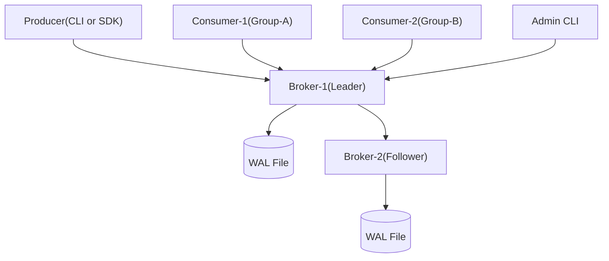

# 🚀 gafka - 분산 메시지 큐 시스템 설계 문서

> **기간**: 2024년 7월 28일 ~ 9월 26일 (9주)  
> **목표**: Kafka 핵심 개념을 담은 메시지 큐 MVP 구현 + 분산 시스템 설계 역량 습득

---

## 1. 🧠 Why - 왜 이 시스템을 만드는가?

### 📌 문제 정의

기존 시스템에서 서비스 간 직접 호출 방식은 다음과 같은 한계를 가진다:

* **결합도**: 프로듀서와 컨슈머 간 강결합으로 서비스 변경 시 영향도가 큼
* **확장성**: 대용량 처리 시 동시성 확보 어려움
* **신뢰성**: 네트워크 이슈 발생 시 메시지 유실 가능
* **복원력**: 장애 시 전체 흐름 중단 (예: 동기 호출 실패 전파)

### 🎯 설계 목표

| 항목               | 목표 수치                       | 테스트 조건                     |
|-------------------|----------------------------|-----------------------------|
| **처리량 (Throughput)** | ≥ 5,000 msg/s (1KB 메시지 기준) | 단일 브로커 + 2파티션 (HTTP/JSON 한계 고려) |
| **지연시간 (Latency)**   | 평균 ≤ 100ms, P95 ≤ 200ms      | E2E 측정 (Producer→Consumer) |
| **내구성**              | 승인된 메시지 100% 복구 보장               | WAL 기반 완전 복구 테스트              |
| **장애 복구 시간**         | ≤ 30초 (수동 복구 포함)            | 브로커 강제 종료 후 복구 시나리오        |
| **순서 보장**            | 파티션 내 100% 순서 보장            | 메시지 순서 테스트                 |

---

## 2. 📌 What - 무엇을 만드는가?

### ✔️ 기능 요구사항
- [x] **토픽/파티션 구조**: hash(key) % partitions 라우팅
- [x] **메시지 배칭 및 전송**: 네트워크 효율성 향상 (100개 또는 10ms 단위)
- [x] **오프셋 기반 소비 및 재처리**: 장애 시 특정 지점부터 재시작
- [x] **메시지 영속화 (WAL)**: 브로커 재시작 후에도 데이터 유지
- [x] **Consumer Group 지원**: 메시지 병렬 처리 및 로드 밸런싱
- [x] **Long Polling 기반 Pull**: 실시간성과 효율성 균형
- [x] **리더-팔로워 복제**: 데이터 이중화 (단순 구현)
- [x] **Heartbeat & 파티션 할당 유지**: Consumer 생존 확인

| **비기능 요구사항** |
- [x] **고성능 처리**: 5K msg/s 이상 (HTTP/JSON 제약 고려)
- [x] **평균 지연시간**: 100ms 이하
- [x] **장애 복구**: 시나리오 기반 복구 매뉴얼
- [x] **테스트 기반 개발**: TDD 적용
- [x] **확장 가능 아키텍처**: Phase 2에서 gRPC/TCP 마이그레이션

### 📖 예상 시나리오
1. **로그 수집**: 애플리케이션 로그 → 중앙 저장소 전달
2. **이벤트 처리**: 주문 생성 이벤트 → 재고/결제 서비스 알림
3. **데이터 파이프라인**: 실시간 데이터 → 분석 시스템 전달

---

## 3. ⚙️ How - 어떻게 구현할 것인가?

### 🧱 시스템 아키텍처 (MVP)



### 🧩 주요 컴포넌트와 책임

| 컴포넌트 | 역할 | 설명 |
|---------|------|------|
| **Producer** | 메시지 전송, 파티셔닝 | key 기반 라우팅 (hash(key) % N) |
| **Broker** | 메시지 수신/저장/서빙 | WAL 기반 영속성, Consumer 요청 응답 |
| **Consumer** | 메시지 Pull, 오프셋 관리 | Long Polling, 컨슈머 그룹 지원 |
| **Coordinator (MVP 단순화)** | Consumer Group 및 할당 상태 유지 | 인메모리 구현, Heartbeat로 리밸런싱 감지 |
| **WAL** | 메시지 복구용 로그 | offset, checksum 포함 |
| **Replication** | 리더→팔로워 비동기 복제 | 리더 기준 최신 메시지 전달 |

### 🧠 코디네이터 설계 (간소화 MVP 기준)

| 항목 | MVP 설계 기준 |
|------|-------------|
| **Group Metadata** | 브로커 인메모리로 관리 (etcd 등 외부 도구 없음) |
| **Consumer Registration** | `group_id`, `consumer_id`로 등록 |
| **Heartbeat API** | 주기적 호출 (예: 5초) 없으면 리밸런싱 |
| **Partition Assignment** | Round-Robin 방식 단순 구현 |
| **Failover 대응** | heartbeat 누락 시 → 파티션 재할당 |

### 데이터 모델링

```go
// 메시지 구조
type Message struct {
    Topic     string    `json:"topic"`
    Partition int32     `json:"partition"`
    Offset    int64     `json:"offset"`
    Key       string    `json:"key,omitempty"`
    Value     string    `json:"value"`          // MVP에서는 string으로 단순화
    Timestamp int64     `json:"timestamp"`
    Size      int32     `json:"size"`           // 메시지 크기 (KB 제한용)
}

// WAL 엔트리
type WALEntry struct {
    Offset    int64   `json:"offset"`
    Message   Message `json:"message"`
    Checksum  uint32  `json:"checksum"`         // CRC32 체크섬
}

// 파티션 구조
type Partition struct {
    ID          int32             `json:"id"`
    Messages    []Message         `json:"-"`        // 인메모리
    OffsetIndex map[int64]int     `json:"-"`        // 오프셋 → 인덱스
    LastOffset  int64             `json:"last_offset"`
    WALPath     string            `json:"wal_path"`
    MaxSize     int64             `json:"max_size"` // 파티션 최대 크기 (MB)
    mutex       sync.RWMutex      `json:"-"`        // 동시성 제어
}
```

---

## 4. 🛠️ 기술 스택

| 항목 | 기술 | 이유 |
|------|------|------|
| **언어** | Go 1.22 | 빠른 동시성 처리, 간단한 배포 |
| **통신** | HTTP + JSON | 개발 편의성 우선 (성능 제약 인지) |
| **저장** | In-memory + WAL 파일 | 영속성과 성능 간 균형 |
| **CLI** | Cobra | 커맨드 라인 도구 개발 |
| **테스트** | `go test` | TDD 기반 개발 |
| **성능 측정** | wrk, custom tool | Throughput, P95 측정 |
| **로깅** | logrus | 단계별 로깅 처리 |

### 알려진 성능 제약사항

| 제약 요소 | 영향 | 완화 방안 |
|---------|------|----------|
| **HTTP/JSON 오버헤드** | JSON 파싱으로 인한 처리량 제한 (5K msg/s) | 배칭으로 완화, Phase 2에서 gRPC 마이그레이션 |

### 시스템 제한사항
| **인메모리 저장소** | 파티션당 1M 메시지 제한 | WAL 기반 재시작 시 복구, 향후 세그먼트 분할 |

| 제한 항목 | 최대값 | 이유 |
|---------|-------|------|
| **메시지 크기** | 1MB | HTTP 요청 크기 제한, 메모리 사용량 관리 |
| **토픽당 파티션 수** | 100개 | Consumer Group 관리 복잡도 제한 |
| **파티션당 메시지 수** | 1M개 | 인메모리 저장 한계 |
| **Consumer Group 수** | 제한 없음 | 각 그룹은 독립적으로 관리 |
| **Topic명 길이** | 255자 | 파일시스템 호환성 |
| **Consumer ID 길이** | 128자 | HTTP URL 길이 제한 |

---

## 5. 🚀 실행 방법

```bash
# 1. 프로젝트 클론 및 빌드
git clone <repo> && cd gafka
make build

# 2. 브로커 시작 (리더)
./bin/broker --id=1 --port=9001 --data-dir=/tmp/gafka-1 --role=leader

# 3. 브로커 시작 (팔로워)  
./bin/broker --id=2 --port=9002 --data-dir=/tmp/gafka-2 --role=follower --leader=localhost:9001

# 4. 토픽 생성
./bin/admin create-topic --name=test-topic --partitions=2 --broker=localhost:9001

# 5. 메시지 전송
./bin/producer --topic=test-topic --broker=localhost:9001 --message="Hello World" --key="user123"

# 6. 메시지 소비 (Long Polling)
./bin/consumer --topic=test-topic --group=test-group --broker=localhost:9001 --timeout=30s
```

### API 사용 예시

```bash
# 메시지 전송
curl -X POST http://localhost:9001/api/v1/produce \
  -H "Content-Type: application/json" \
  -d '{"topic":"test-topic","key":"user123","value":"Hello World"}'

# 메시지 소비 (Consumer Group 기반 - 브로커가 offset 관리)
curl "http://localhost:9001/api/v1/consume?topic=test-topic&count=10&consumer_id=consumer-1&group_id=test-group&timeout=30s"

# 메시지 소비 (개별 Consumer - 직접 offset 지정)
curl "http://localhost:9001/api/v1/consume?topic=test-topic&partition=0&offset=100&count=10&timeout=30s"

# Consumer Group 상태 확인
curl "http://localhost:9001/api/v1/consumer-groups/test-group/status"

# Consumer Heartbeat
curl -X POST "http://localhost:9001/api/v1/consumer-groups/test-group/members/consumer-1/heartbeat"
```

---

## 6. 🧪 성능 테스트 계획

### 테스트 시나리오

| 테스트 항목 | 도구 | 목표 | 검증 방법 |
|----------|-----|------|----------|
| **처리량 측정** | wrk + Lua | ≥5K msg/s | 1KB 메시지로 30초 부하 |
| **지연시간 측정** | Go client | P95 ≤ 200ms | produce → consume 측정 |
| **장애 복구** | 수동 | ≤30초 | 브로커 kill 후 복원 |
| **배치 효과** | wrk | TPS 비교 | 배치 vs 단건 전송 비교 |

### 성능 테스트 스크립트

```lua
-- scripts/produce.lua (wrk용)
wrk.method = "POST"
wrk.headers["Content-Type"] = "application/json"

-- 1KB 메시지로 테스트
local message_1kb = string.rep("a", 1024)

function request()
    local body = string.format('{"topic":"test-topic","key":"test-%d","value":"%s"}', 
        math.random(1000), message_1kb)
    return wrk.format(wrk.method, wrk.path, wrk.headers, body)
end

function response(status, headers, body)
    if status ~= 200 and status ~= 201 then
        print("Error: " .. status .. " " .. body)
    end
end

function done(summary, latency, requests)
    print("Throughput: " .. string.format("%.2f", summary.requests / (summary.duration / 1000000)) .. " requests/sec")
    print("Average latency: " .. latency.mean / 1000 .. "ms")
end
```

---

## 7. 🧪 TDD 개발 가이드

### TDD 사이클 적용
```
Red → Green → Refactor 사이클 반복
1. 실패하는 테스트 작성
2. 테스트를 통과하는 최소 코드 구현  
3. 코드 개선 (리팩토링)
```

### 주차별 TDD 목표

| 주차 | TDD 테스트 대상 | 예시 테스트 케이스 |
|-----|-------------|---------------|
| **1-2주차** | 메시지 구조체, 파티션 로직 | `TestMessage_Serialize()`, `TestPartition_AddMessage()` |
| **3-4주차** | 프로듀서/컨슈머 API | `TestProducer_SendMessage()`, `TestConsumer_PullMessages()` |
| **5-6주차** | WAL 영속화, Consumer Group | `TestWAL_WriteAndRecover()`, `TestConsumerGroup_Rebalancing()` |
| **7-8주차** | 통합 테스트, 성능 테스트 | `TestBroker_HandleHighLoad()`, `TestFailover_Recovery()` |
| **9주차** | E2E 테스트, 문서화 | `TestFullWorkflow_ProducerToBrokerToConsumer()` |

---

## 8. 🧾 예상 질문 & 대응 전략

| 질문 | 대응 |
|-----|-----|
| **왜 Kafka 클론을 Go로 만드나요?** | 동시성, 학습 효율, 가독성에서 Go가 적합 |
| **외부 Zookeeper/etcd 왜 안 썼나요?** | MVP에선 오히려 복잡도 증가. 향후 확장 계획 있음 |
| **메시지 순서는 어떻게 보장되나요?** | 파티션 내 offset 단위 순차 처리, key 기반 파티셔닝 |
| **브로커 장애 시 복구는 어떻게 되나요?** | WAL 파일 기반 자동 복구 + 팔로워→리더 수동 승격. 리더 선출 자동화는 Phase 2 |
| **Pull 방식의 실시간성은 어떻게 보장되나요?** | Long Polling 사용, 최대 30초 이내 응답 보장 |
| **WAL 손상 시 복구는 어떻게 되나요?** | CRC32 기반 손상 검증, 복구 실패 시 fail-safe 처리 필요 |
| **메시지 중복 방지는?** | at-least-once만 보장. 중복 방지는 Consumer에서 처리 필요 |
| **Consumer Group에서 동시성 문제는 어떻게 해결하나요?** | Heartbeat + 파티션 할당으로 한 파티션은 한 Consumer만 소비. 409 Conflict로 중복 방지 |
| **HTTP + JSON 성능 한계는 어떻게 해결하나요?** | MVP에서는 개발 편의성 우선. 5K msg/s 목표로 현실적 설정. Phase 2에서 gRPC로 마이그레이션 |
| **Zero-copy 최적화는 HTTP에서 가능한가요?** | HTTP 스택에서는 불가능. Phase 2에서 TCP 기반 커스텀 프로토콜로 전환해야 구현 가능 |

---

## 9. 🗓️ 개발 일정 (주차별)

| 주차 | 핵심 구현 사항 | TDD 목표 | 검증 기준 |
|-----|-------------|----------|----------|
| **1주차<br/>(7/28-8/3)** | 프로젝트 셋업, 메시지 구조체 | Message, Partition 단위 테스트 | 테스트 커버리지 > 80% |
| **2주차<br/>(8/4-8/10)** | 파티션 로직, WAL 기본 구현 | WAL 읽기/쓰기 테스트 | 파일 영속화 동작 확인 |
| **3주차<br/>(8/11-8/17)** | HTTP API, 프로듀서 구현 | HTTP 핸들러 테스트 | 1K msg/s 처리 확인 |
| **4주차<br/>(8/18-8/24)** | 컨슈머, 오프셋 관리 | 컨슈머 그룹 테스트 | E2E 메시지 플로우 동작 |
| **5주차<br/>(8/25-8/31)** | 배칭, 성능 최적화 | 배칭 로직 테스트 | 5K msg/s 목표 달성 |
| **6주차<br/>(9/1-9/7)** | Consumer Group, 파티션 할당 | 리밸런싱 테스트 | Consumer 추가/삭제 시 자동 재할당 |
| **7주차<br/>(9/8-9/14)** | 복제 기능, 장애 복구 | 복제 동기화 테스트 | 데이터 일관성 확인, 30초 내 복구 |
| **8주차<br/>(9/15-9/21)** | 성능 테스트, 버그 수정 | 부하 테스트 자동화 | 모든 성능 목표 달성 |
| **9주차<br/>(9/22-9/26)** | 문서화, 데모 준비 | 통합 테스트 완료 | README, API 문서 완성 |

---

## 10. 📦 디렉토리 구조 (Go Best Practice)

```
gafka/
├── cmd/                           # 애플리케이션 진입점
│   ├── broker/
│   │   └── main.go               # 브로커 서버 실행
│   ├── producer/
│   │   └── main.go               # 프로듀서 CLI
│   ├── consumer/
│   │   └── main.go               # 컨슈머 CLI
│   └── admin/
│       └── main.go               # 관리 도구 CLI
├── internal/                      # 내부 패키지 (외부 노출 불가)
│   ├── broker/                   # 브로커 코어 로직
│   │   ├── broker.go
│   │   ├── broker_test.go
│   │   ├── partition.go
│   │   ├── partition_test.go
│   │   ├── wal.go
│   │   ├── wal_test.go
│   │   ├── replication.go
│   │   └── replication_test.go
│   ├── producer/                 # 프로듀서 로직
│   │   ├── producer.go
│   │   ├── producer_test.go
│   │   ├── batcher.go
│   │   ├── batcher_test.go
│   │   └── partitioner.go
│   ├── consumer/                 # 컨슈머 로직
│   │   ├── consumer.go
│   │   ├── consumer_test.go
│   │   ├── group.go
│   │   ├── group_test.go
│   │   └── offset.go
│   └── api/                      # HTTP API 핸들러
│       ├── handlers.go
│       ├── handlers_test.go
│       ├── middleware.go
│       └── routes.go
├── pkg/                          # 외부 패키지 (재사용 가능)
│   ├── protocol/                 # 메시지 프로토콜
│   │   ├── message.go
│   │   └── message_test.go
│   └── client/                   # Go 클라이언트 SDK
│       ├── client.go
│       └── client_test.go
├── configs/                      # 설정 파일
│   ├── broker.yaml
│   └── examples/
├── scripts/                      # 스크립트 및 도구
│   ├── produce.lua              # wrk 테스트 스크립트
│   ├── setup.sh                 # 환경 설정
│   └── benchmark.sh             # 성능 테스트
├── docs/                        # 문서
│   ├── api.md                   # API 문서
│   ├── architecture.md          # 아키텍처 가이드
│   └── operations.md            # 운영 가이드
├── examples/                    # 사용 예시
│   ├── simple_producer/
│   └── simple_consumer/
├── Makefile                     # 빌드 스크립트
├── go.mod                       # Go 모듈 정의
├── go.sum                       # 의존성 체크섬
├── README.md                    # 프로젝트 개요
└── .gitignore                   # Git 무시 파일
```

---

## 11. 📌 향후 과제

### Phase 1 - MVP (현재)
- [x] 기본 프로듀서/컨슈머 구현
- [x] 단일 브로커 WAL 저장소
- [x] HTTP API 기반 통신

### Phase 2 - 성능 최적화 및 프로토콜 마이그레이션
- [ ] gRPC 기반 통신으로 마이그레이션
- [ ] TCP 커스텀 프로토콜 (Zero-copy 지원)
- [ ] 메시지 압축 (gzip, snappy)
- [ ] Consumer Group 오프셋 영속화

### Phase 3 - 분산 시스템 확장
- [ ] 리더 자동 선출 (Raft 등)
- [ ] 크로스 데이터센터 복제
- [ ] 파티션 자동 분할
### Phase 4 - 운영 기능
### Phase 4 - 운영 기능
- [ ] Prometheus 기반 모니터링
- [ ] TLS, 인증 등 보안 기능
- [ ] Docker 컨테이너 배포
- [ ] Kubernetes 매니페스트

---

## ✅ 성공 기준

### 기능적 기준
- [x] **메시지 처리량**: 단일 브로커 5K msg/s 이상 (1KB 메시지, HTTP/JSON 기준)
- [x] **메시지 순서 보장**: 파티션 내 100% 순서 유지
- [x] **데이터 영속성**: 승인된 메시지 WAL 기반 100% 복구 보장
- [x] **기본 복제**: 리더-팔로워 간 비동기 복제 정상 동작
- [x] **Consumer Group**: 파티션별 단일 Consumer 보장

### 기술적 기준
- [x] **테스트 커버리지**: 80% 이상 유지
- [x] **TDD 준수**: 모든 기능을 테스트 먼저 작성
- [x] **코드 품질**: Go lint 규칙 준수
- [x] **API 문서**: OpenAPI 스펙 완성

### 학습 목표 달성도
- [x] **메시지 큐 핵심 개념**: 토픽, 파티션, 오프셋 이해
- [x] **분산 시스템 기초**: 복제, 일관성, 장애 복구 경험
- [x] **고성능 I/O**: WAL, 배칭 기법 구현
- [x] **TDD 역량**: 테스트 주도 개발 완성
