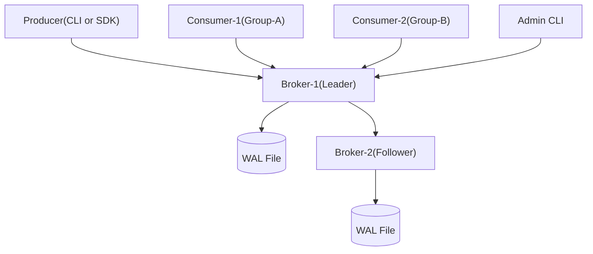

# gafka
## Go 기반 분산 메시지 큐 설계 및 구현

**Kafka를 직접 구현하며 분산 시스템 역량 강화**  
👨‍💻 발표자: 한결  
📅 발표일: 2025-07-27

---

## 🧠 Why - 왜 만들었는가?

### 기존 아키텍처의 문제
- 서비스 간 직접 호출: **결합도 높음**
- 장애 전파: **신뢰성/복원력 부족**
- 네트워크 이슈 시 **데이터 유실**

### 학습 목표
- Go 기반으로 직접 구현하며 Kafka의 핵심 개념 실습 
- WAL, 배치 처리, 컨슈머 그룹 등 핵심 컴포넌트 설계

---

## 🎯 설계 목표 및 성능 지표

| 항목        | 목표                        | 테스트 기준                   |
|-------------|-----------------------------|-------------------------------|
| 처리량       | ≥ 5,000 msg/s               | 1KB 메시지 기준 wrk 부하      |
| 지연시간     | 평균 ≤ 100ms, P95 ≤ 200ms   | Producer → Consumer E2E 측정 |
| 내구성       | 100% 복구 보장              | WAL 기반 재시작 시나리오     |
| 장애 복구     | ≤ 30초                      | 브로커 kill 후 재가동         |
| 순서 보장     | 파티션 내 순서 100% 유지     | 오프셋 기반 순차 처리 검증    |

---

## 📌 What - 무엇을 만드는가?

### 핵심 기능 요약
- Producer ↔ Broker ↔ Consumer 구조
- **WAL 기반 메시지 영속성**
- **리더-팔로워 복제 구조**
- **컨슈머 그룹** + 오프셋 기반 재처리
- **Long Polling 기반 Pull 모델**
- **Key 기반 파티셔닝 (hash(key) % N)**

---

## 🧩 시스템 아키텍처 (MVP)



> MVP 단계에서는 HTTP + JSON 통신 / 인메모리 코디네이터

---

## 🔄 데이터 흐름

1. Producer가 Key 기반 파티션 선택
2. Broker가 메시지 수신 → WAL 기록
3. 리더 → 팔로워 비동기 복제
4. Consumer는 Long Polling으로 Pull
5. 오프셋 기반 재처리 가능

---

## 💾 메시지 구조와 WAL

```go
type Message struct {
	Topic     string   
	Partition int32   
	Offset    int64   
	Key       string   
	Value     string   
	Timestamp int64   
	Size      int32 
}
```

- **WAL**: 로그 단위 저장, 장애 시 복구
- **Checksum 무결성 보장**과 **세그먼트 기반 저장 구조** 도입 예정

---

## 👥 Consumer Group 및 리밸런싱

- 컨슈머 그룹은 오프셋을 공유함
- 하나의 파티션은 하나의 컨슈머에게만 할당됨
- heartbeat 기반 생존 체크
- 브로커 장애 시 자동 재할당 수행 예정 (현재는 MVP 수준)

---

## ⚙ 기술 스택

|항목|기술|이유|
|---|---|---|
|언어|Go 1.22|동시성, 빠른 빌드|
|통신|HTTP + JSON|MVP 개발 편의성|
|저장|In-memory + WAL|속도 + 영속성 균형|
|CLI|cobra|명령어 기반 유틸|
|테스트|go test|TDD 적용|
|성능 측정|wrk|TPS, Latency 측정|
|로깅|logrus|단계별 로깅|

---

## 🧪 성능 테스트 계획

|항목|도구|목표|검증 방법|
|---|---|---|---|
|TPS|wrk|≥ 5K msg/s|1KB 메시지 30초 부하|
|Latency|go client|P95 ≤ 200ms|produce → consume|
|장애 복구|수동|≤ 30초|브로커 kill 후|
|배치 효과|wrk|개선 확인|배치 vs 단건|

---

## 🗓 개발 일정 요약 (9주)

|주차|구현 목표|
|---|---|
|1~2주|파티션, WAL|
|3~4주|API, Producer|
|5~6주|Consumer Group, 리밸런싱|
|7~8주|복제, 장애 복구|
|9주차|통합 테스트, 문서화|

---

## 🔮 향후 확장 계획 (Phase 2+)

- gRPC / TCP 커스텀 프로토콜
- 메시지 압축 (gzip/snappy)
- 리더 자동 선출 (Raft)
- 메타데이터 영속화 (Zookeeper 또는 etcd)

---

## ✅ 요약

- Kafka의 핵심 개념을 바닥부터 구현한 실습형 프로젝트
- Go 기반 분산 메시지 큐 설계와 성능 최적화 경험
- 확장 가능한 구조와 실무 수준 테스트 전략 포함

---

## ❓ Q&A

> 궁금한 점 물어보세요!  

